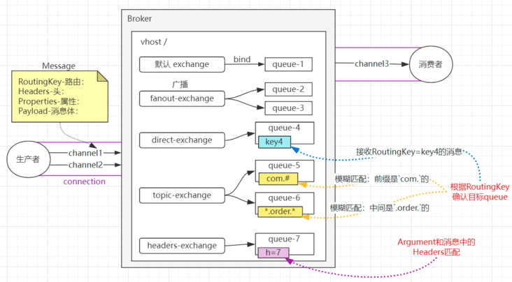
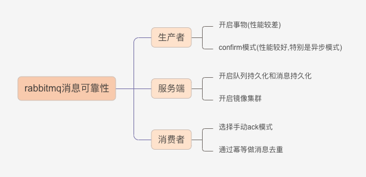

# 消息队列

## 概念
> 
## 消息可靠性
> 
- 手动ack有个超时问题,超时broker会重发消息
- exchange也需持久化(durable)
- 进度百分比,(redis list 50万 => 5000 * 100)
### 集群
- 普通集群
- 镜像集群
## 延迟队列插件
- rabbitmq-delayed-message-exchange
  - 延迟极限: 2^32 - 1

## 参数
1. contentType ： 消息内容的类型
2. contentEncoding： 消息内容的编码格式
3. priority： 消息的优先级
4. correlation_id：关联id
5. reply_to: 用于指定回复的队列的名称
6. expiration： 消息的失效时间
7. messageId： 消息id
8. timestamp：消息的时间戳
9. type： 类型
10. userId: 用户id
11. appId： 应用程序id
12. Payload: 消息内容
13. mandatory 没找到队列就返回这个消息
14. deliveryMode 是否持久化: 1 否, 2 是
15. persistent 
16. headers
17. type
18. persistent 设置持久化(重启后队列必须还在)会覆盖deliveryMode
19. CC routing keys 会覆盖headers里的key,大小写敏感
20. BCC 不会覆盖headers里的

## 参考
- [自定义带插件的mq镜像](https://codehunter.cc/a/docker/how-to-add-plugin-to-rabbitmq-docker-image)
- [rabbitmq快速入门](https://developer.aliyun.com/article/990034?spm=a2c6h.12873639.article-detail.28.13ac48f7Qliawb&scm=20140722.ID_community@@article@@990034._.ID_community@@article@@990034-OR_rec-V_1)
- [消息丢失处理](https://segmentfault.com/a/1190000040856612?utm_source=sf-similar-article)
- [工作模式](https://github.com/ddzyan/node-amqplib)
- [mq api](https://amqp-node.github.io/amqplib/channel_api.html)