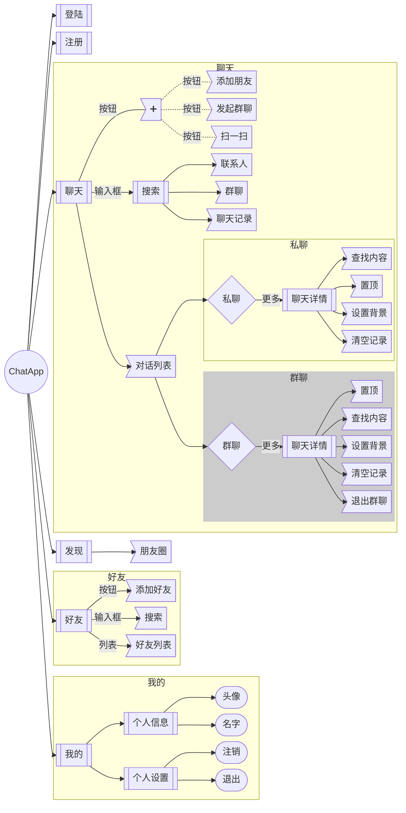

# IM 

## 功能
- 登陆注册注销
- 好友列表
- 搜索添加好友
- 私聊/组群列表
- 未读消息
- 设置对话:免打扰/置顶/背景/
- 发送文字/图片/视频
- 消息删除/撤回
- 录制语音/转文字
- 个人信息设置:头像/名称

## 页面
- 登陆
- 注册
- 注销
- 消息列表
- 私聊页面
- 好友列表(添加/搜索/组群)
- 组群列表
- 组群页面
- 搜索列表
- 个人资源
- 个人详情

## 表与接口
### 用户表
> 对接用户系统

### 消息表 message
| 字段       | 类型   |                                                                |
|------------|--------|----------------------------------------------------------------|
| _id        | string |                                                                |
| chat_id    | string |                                                                |
| created_at | date   |                                                                |
| status     | string | 0 发送失败, 1 已发送, 2 撤回,                                  |
| type       | number | 1 文字 2 图片 3 表情 4 语音 5 视频 6 文件                      |
| send_id    | string | 发送者id                                                       |
| recv_id    | string | 接收者id                                                       |
| payload    | object | { ref_id, content, file_url, image_url, video_url, audio_url } |

### 会话表 chat
| 字段       | 类型   |                              |
|------------|--------|------------------------------|
| _id        | string | 用于会话列表和设置           |
| chat_id    | string | 用于消息列表查询             |
| owner_id   | string |                              |
| chat_type  | number | 1 私信 2 群聊 3 订阅号       |
| friend_id  | string |                              |
| created_at | date   |                              |
| updated_at | date   |                              |
| settings   | object | { top, muted, background,  } |

### 好友表 friend
| 字段       | 类型   |   |
|------------|--------|---|
| _id        | string |   |
| name       | string |   |
| created_at | date   |   |

## 流程图

#### **代码说明**

