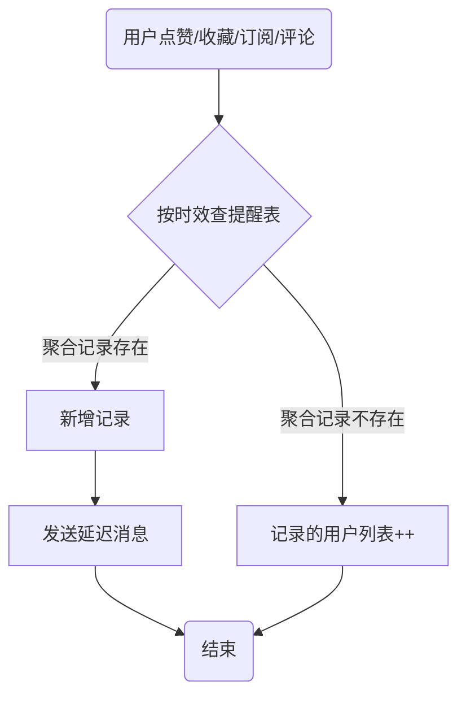
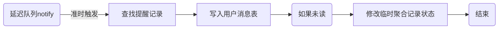
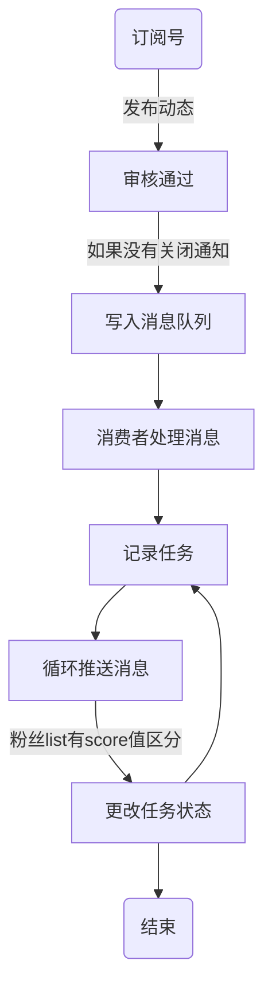

# 消息与任务
> 凤凰秀消息中心分为私聊,消息,提醒(notification),推送(push)等几个部分 \
> 任务事件通过消息队列异步处理.减轻系统高峰时的压力,解耦不同项目的调用问题

## 任务队列
- 任务类型
  - 关注的订阅号发布动态,向粉丝推送信息
  - 同步列表数据
  - 同步指定条件数据库数据到es
  - 积分换算任务
  - 直播互动消息落盘任务
  - 内容运营人员推送
  - 活动通知
  - 审核通过短信
  - 系统版本升级，升级包拉取等动作通知
- 任务优先级
- 错误处理
  - 重要数据必须持久化
  - 失败的任务重试功能
- 接口和数据结构
  - 各个系统都接入mq集群,每个项目既有生产者又有消费者
  ```js
  // body
  {
    // type: string, // path参数,任务类型
    created_time: date, // 产生时间
    creator_id: string, // 创建者id
    creator_type: string, // 创建者类型
    creator_name:string, //创建者名称
    data: object, // 任务额外参数
    title: string,
    content: string,
  }
  ```
  - 查询任务(状态类型): `GET /api/v1/tasks/:type`
  - 修改任务: `PUT /api/v1/tasks/:type`
  - 重试: `PATCH /api/v1/tasks/:type/:id`

## message
> 分为直播聊天,私信.详细设计见 messageService
- 私信功能
  - 接收设置: 见下文提现设置
  - 发送消息类型
    - 语音
    - 文字+表情
    - 图片
    - 定位
    - 文件
    - 链接
  - 接口
    - 消息拉取: 
    - 删除消息
    - 撤回消息

### message场景
- 订阅号和用户
- 用户和用户
- 直播间互动

## 系统消息
> 分为应用内和应用外.需要定义好结构,主要是客户端接收到消息后怎么处理
- 客户端
  - 消息类型
    - 退出登录
    - 弹框提醒
    - 数据更新(如提醒,私信)
    - 推送顶部提醒
- 服务端
  - 手动发送类型
  - 业务逻辑自动发送类型
- 消息数据结构
  ```js
  {
    _id: string,
    type: string,       // 消息类型
    platform: [string], // 接收平台
    method: [string],   // 接收方式. push,sms,
    title: string,
    content: string,
    recipient: object,  // 接收目标
    sendor: {           // 发送者
      _id: string,
      name: string,
    },
    data: object,       // 其他参数
    created_time: date, // 创建时间
    published_time: date, // 可以设置定时发布
  }
  ```
- 系统消息已读
  - 全局消息: 系统消息一张表,用户是否已读用另外的表
  - 单个用户消息: 用户消息表增加是否已读字段(is_read)

## 提醒消息(notification)
- 功能需求
  - 提醒类型
    - 点赞
    - 评论回复
    - 关注
    - 私信(用户和订阅号)
  - 提醒设置
    - 消息提醒设置(notification): 关闭/开启
      - 回复消息设置(comment)
      - 点赞消息设置(praise)
      - 关注消息设置(subscribe)
      - 私信消息设置(user/subscription)(针对订阅号或用户)
    - 消息设置表设计
      - 默认全部开启
      - 接收设置(只接收关注的人)
      - 删除聊天: 清空消息列表,available=0.(设置不变)
      - 私信聊天列表
  - 查询优化
    - 将用户前M条消息(前3页)放入redis的list中,超过部分读取数据库.(如果转移了老旧数据到记录表,可以全部放list中)
    - 通过header中的X-Hub和X-Fill信息,将计数和资源填充在项目间调用时灵活处理
    - 未查询到的数据显示为删除状态
    - 超过最长限制天数的消息(包括未读)转移到记录表,减轻主表查询压力
- 表设计
  - 提醒表: notification_praise_info, notification_comment_info, notification_subscribe_info
    ```js
    {
      _id: string,
      owner_id: string, // 消息接收者
      user_id: string,  // 消息触发者
      // user: 用户详情
      type: number, // praise,comment,reply,subscribe,
      // resource: 资源详情
      resource_id: string,
      resource_type: string,
      is_read: number, // 是否已读. 0 未读, 1 已读
      available: number, // 是否删除.
      created_time: date,
      // target: 回复评论和点赞收藏,属于媒体资源类型的应该有target信息
      target_id: string,
      target_type: string,
      content: string,
    }
    ```
  - 提醒设置表: notification_setting_info
    ```js
    {
      _id: string, // notification,praise,comment,subscribe,用户id或订阅号id
      type: string, // notification, user_id, SUBSCRIPTION_ID
      owner_id: string, // 设置的拥有者
      status: number, // 0: 关闭, 1: 开启, 2: 关注的人 3: 免打扰(不显示数字) 4: 拒收
      created_time: date,
      modified_time: date,
      available: number, // 0: 不显示在列表,删除会清空聊天记录
      top: number, // 置顶
    }
- 接口设计
  - 消息中心
    - 消息列表(按页码,类型): `POST /api/v1/notifications/:type`
    - 消息已读: `POST /api/v1/notifications/:type/read`
    - 删除消息: `DELETE /api/v1/notifications/:type/:id`
    - 全部已读: `POST /api/v1/notifications/:type/read_all`
    - 获取消息计数: `GET /api/v1/counter/notifications`
  - 消息设置
    - 设置接收参数: `PUT /api/v1/notification-setting/:type/:id`
  - 私信接口
    - 私信列表: `GET /api/v1/chats`
    - 删除(用户)私信: `DELETE /api/v1/chats/:type/:id`
    - 私信置顶: `PUT /api/v1/notification-setting/:type/:id`
    - 聊天接口复用腾讯云IM功能

  ```

## 方案流程
> vscode mermaid 拓展
### 消息可靠性
- exchange,queue,message 设置durable进行持久化
- 消费消息时手动ack
- 

### 提醒消息聚合方案
> 业务流程

> 消息处理流程


### 订阅方案
> 粉丝数量多,服务器宕机/重启会影响.创建任务表记录状态保证不丢失(超过失效不处理也可以) \
> 极光推送一次可以发1000


### 系统消息方案
- 

## 参考
- [站内消息系统](https://qsjzwithguang19forever.gitee.io/framework-learning/gitbook_doc/system_architecture_design/%E7%AB%99%E5%86%85%E6%B6%88%E6%81%AF%E7%B3%BB%E7%BB%9F%E7%9A%84%E8%AE%BE%E8%AE%A1.html)
- [凤凰消息机制](http://octopus.phoenixtv.com/fengshows/repository/-/wikis/message)